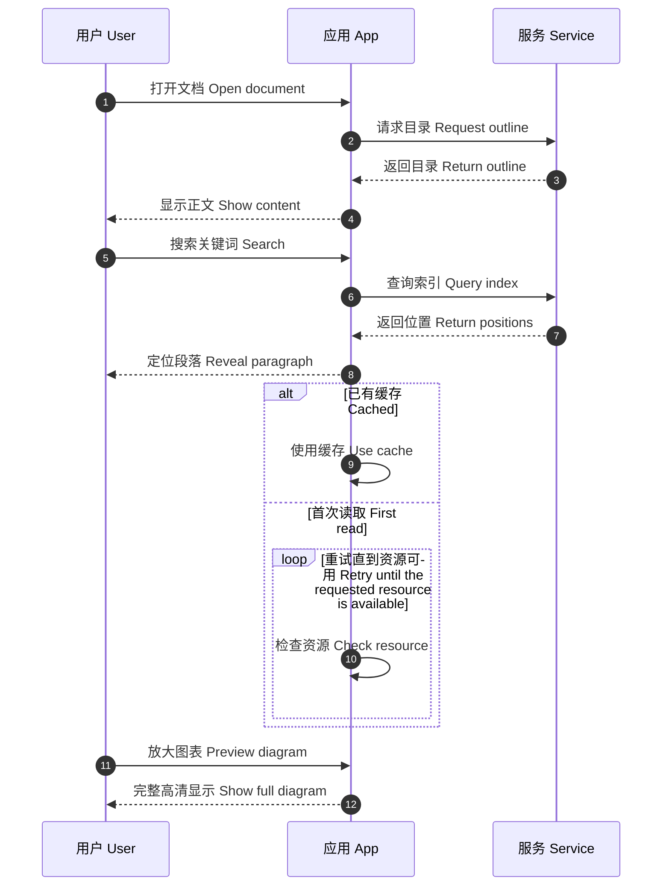

# Mermaid 嵌套条件与长描述验收

当前已知问题：下列图表嵌套 alt 与 loop，并使用较长的循环描述。条件标签和循环描述可能重叠；阅读与导出共用图表渲染，因此两处都需要检查。本项尚未作为已通过的修复项。

```mermaid
sequenceDiagram
    autonumber
    participant U as 用户 User
    participant A as 应用 App
    participant S as 服务 Service
    U->>A: 打开文档 Open document
    A->>S: 请求目录 Request outline
    S-->>A: 返回目录 Return outline
    A-->>U: 显示正文 Show content
    U->>A: 搜索关键词 Search
    A->>S: 查询索引 Query index
    S-->>A: 返回位置 Return positions
    A-->>U: 定位段落 Reveal paragraph
    alt 已有缓存 Cached
        A->>A: 使用缓存 Use cache
    else 首次读取 First read
        loop 重试直到资源可用 Retry until the requested resource is available
            A->>A: 检查资源 Check resource
        end
    end
    U->>A: 放大图表 Preview diagram
    A-->>U: 完整高清显示 Show full diagram
```

请对照父条件标签、循环说明和箭头是否相互覆盖，记录正文宽度、图表字体与放大比例。
